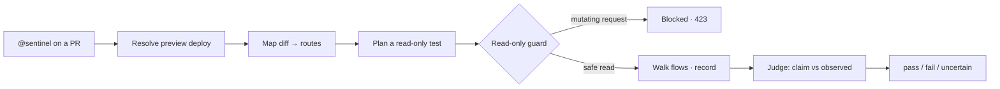

<p align="center">
  <a href="https://github.com/textyess/Sentinel">
    <picture>
      <source media="(prefers-color-scheme: dark)" srcset="public/brand/png/sentinel-eye-dark-512.png">
      
    </picture>
  </a>
</p>

<h1 align="center">Sentinel</h1>

<p align="center">
  An autonomous browser agent that learns your web app, then tests your pull requests<br>
  in a real, recorded browser and reports a verdict. <strong>Read-only by design — safe to point at production.</strong>
</p>

<p align="center">
  <a href="LICENSE"></a>
  = 22" src="https://img.shields.io/badge/node-%3E%3D22-339933?logo=node.js&logoColor=white">
  
  
</p>

<p align="center">
  <a href="#how-it-works"><strong>How it works</strong></a> ·
  <a href="#quickstart"><strong>Quickstart</strong></a> ·
  <a href="#safety"><strong>Safety</strong></a> ·
  <a href="#the-sentinel-pr-bot"><strong>PR bot</strong></a> ·
  <a href="DEPLOY.md"><strong>Deploy</strong></a>
</p>

---

## What it does

Sentinel learns your app by crawling it into an **interaction graph**, then — for any PR — resolves the PR's preview deployment, walks the flows the diff actually touches in a recorded browser, and emits a structured **`pass` / `fail` / `uncertain`** verdict with evidence.

It's a **repo-agnostic core** (`src/core/`) plus **per-app adapters** (`src/adapters/`), so one engine targets any web app — a new app is a new adapter (or a no-code dashboard registration), never a core change. And every run is read-only: two independent safety guards plus a network-level write blocker mean even a misclick on a "Delete account" button never reaches your server.

> [!IMPORTANT]
> Sentinel never issues writes. Mutating requests (`POST`/`PUT`/`PATCH`/`DELETE`) are blocked unless they match the adapter's auth-only allow-list — and on the deployed bot, read-only is forced unconditionally.

## How it works

Tag `@sentinel` on a PR (or run the CLI), and the pipeline is the same:



An LLM **plans** a read-only browser test from the PR, a goal-directed executor **runs** it on the preview (navigate / click / type / assert, resolving the PR's new controls live, with vision asserts on screenshots), records video, and an LLM **judges** whether the PR does what it claims — preferring `uncertain` over a fabricated green.

| Phase | What it delivers | Commands |
| --- | --- | --- |
| **0 · Foundation** | Safety guards, Playwright driver (video + network/console capture + saved session), auth bootstrap. | `guard` · `login` · `smoke` |
| **1 · Learn** | `crawl` builds the interaction graph (bounded BFS + LLM-guided actuation); `sitemap` renders it as Markdown. | `crawl` · `sitemap` |
| **2 · Replay** | `pr <N>` maps the diff to routes and re-walks the affected flows with video + diffs vs baseline. | `pr <N>` |
| **3 · Verify** | `verify <N>` plans, runs, records, and judges a read-only test on the preview. | `verify <N>` |

## Quickstart

> Requires Node `>= 22`, [pnpm](https://pnpm.io), and an LLM key (simplest: Anthropic). Runs via `tsx` — no build step for the CLI.

```bash
cp .env.example .env                      # set SENTINEL_EMAIL / SENTINEL_PASSWORD / SENTINEL_BASE_URL + an LLM key
pnpm install
pnpm exec playwright install chromium     # one-time, if Chromium isn't installed

pnpm guard       # safety preflight — no browser needed
pnpm login       # log in once, save the session
pnpm crawl       # learn the app into an interaction graph
pnpm verify 123  # verify PR #123 against its preview
```

Artifacts — video, screenshots, the interaction graph, and redacted run manifests — land in `.sentinel/` (gitignored).

## Onboard your app with Claude Code (one command)

Prefer not to wire it up by hand? Install the onboarding skill into your app's repo and let
Claude Code do it:

```bash
npx skills add textyess/sentinel --skill sentinel-onboarding
```

Then, in your app repo, ask Claude Code to "set up Sentinel". The skill inspects your
framework, login flow, and routes, writes a no-code project config, registers it, runs a
validated baseline crawl + login check, and confirms a PR diff maps to sensible routes — the
whole [first-run setup](DEPLOY.md) as one guided flow. It never edits the engine and never
weakens the read-only safety boundary. See [`.claude/skills/sentinel-onboarding`](.claude/skills/sentinel-onboarding/SKILL.md).

## Commands

| Command | What it does |
| --- | --- |
| `pnpm guard` | Run the production preflight; print whether the run is clamped to read-only, and why. |
| `pnpm login` / `pnpm smoke` | Save an authenticated session / boot → log in → screenshot → report blocked writes. |
| `pnpm crawl` / `pnpm sitemap` | Build the interaction graph / render it as a Markdown sitemap. |
| `sentinel register --config <file>` | Register a no-code (generic) project from a JSON config so the CLI can drive it. |
| `sentinel affected-routes --project <slug> --files <csv>` | Map a PR's changed files to routes — the diff round-trip check. |
| `pnpm pr <N>` | Replay PR #N's affected flows against its preview, with video. |
| `pnpm verify <N>` | Plan → execute → judge a read-only test: `pass` / `fail` / `uncertain`. Add `--plan-only` to just print the plan. |
| `pnpm dev` | The Next.js dashboard (UI + API) on `127.0.0.1:4317`. |
| `pnpm typecheck` | `tsc --noEmit` — the build / CI gate. |

`crawl`, `pr`, and `verify` take flags (`--max-pages`, `--base-url`, `--max-flows`, …); run any with `--help`. Every run command — `guard`, `login`, `smoke`, `crawl`, `sitemap`, `skills` (and its subcommands), `pr`, and `verify` — accepts `--project <slug>` to drive a registered no-code project instead of a built-in adapter.

## Safety

This is why Sentinel can run against a live environment. A **decision** clamps the run to read-only, and **enforcement** makes that physically real.

**Two signals decide, either one is enough.** A **production preflight** scans the datastores / API origins a run can touch against the adapter's `productionMarkers`; a **remote-host fail-safe** treats any non-local host (anything but `localhost`/`127.0.0.1`/`*.local`/…) as potentially production. When either fires, read-only is forced regardless of config — so an *undetected* prod host still can't become a write path.

**The network guard enforces it.** Every request is intercepted ([`read-only-guard.ts`](src/core/safety/read-only-guard.ts)) and service workers are blocked so nothing escapes. Blocked mutations are **fulfilled locally with HTTP `423`** (never network-aborted, which would trip dev-server error overlays); the auth allow-list matches the URL **path only** so query-string tricks can't smuggle a write; GraphQL reads-over-POST pass but mutations don't; and secrets are redacted before anything is logged or posted.

## The `@sentinel` PR bot

A self-hosted team bot that's **outbound-only** — it polls GitHub via the `gh` CLI and opens the app under test, so there's **no inbound webhook, no public URL, no TLS** to set up. On an `@sentinel` mention it runs the verify pipeline, judges a verdict, and posts back a single link to the run's **report page** (verdict, plan, step-by-step results, and recording all live on the dashboard). Preconditions like a missing baseline crawl are surfaced, not crashed.

```bash
pnpm dev   # dashboard on http://127.0.0.1:4317
```

> [!WARNING]
> The dashboard has no authentication and can trigger runs and read/write env vars. Keep it on localhost or behind a VPN — never expose it publicly.

## Deploy & extend

- **[DEPLOY.md](DEPLOY.md)** — run Sentinel as an always-on bot on Railway or Docker (`docker compose up -d --build`). It only needs outbound access, so no public URL is required.
- **[CONTRIBUTING.md](CONTRIBUTING.md)** — local setup, the Biome style, and how to add a new app (generic adapter from the dashboard — no code — or a built-in adapter for first-party apps). The non-negotiables: keep `core/` repo-agnostic, never weaken the safety boundary, and redact before logging.

## Layout

```
src/
  core/       # repo-agnostic engine: safety · browser · auth · graph · crawler · pr · verify · reasoner · human
  adapters/   # per-app config — generic + built-in; the open-source core ships zero built-ins
  server/     # dashboard services: API, mention poller, runner, SSE hub
  cli.ts      # the `sentinel` CLI
app/          # Next.js dashboard — UI and API in one server
```

Built with TypeScript (ESM, via `tsx`), Playwright, the [Vercel AI SDK](https://sdk.vercel.ai/) (Anthropic / OpenAI / AWS Bedrock), Next.js + shadcn/ui, and optional [Langfuse](https://langfuse.com/) tracing.

## License

[MIT](LICENSE) © 2026 TextYess.
