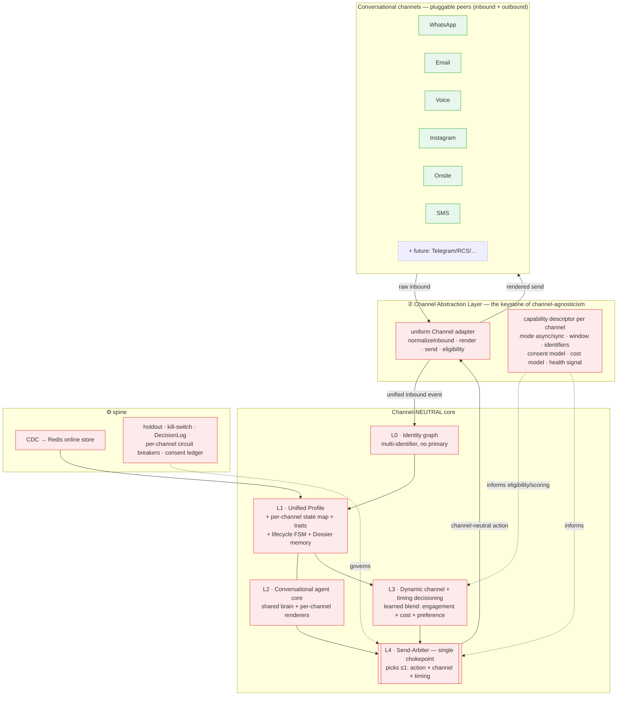
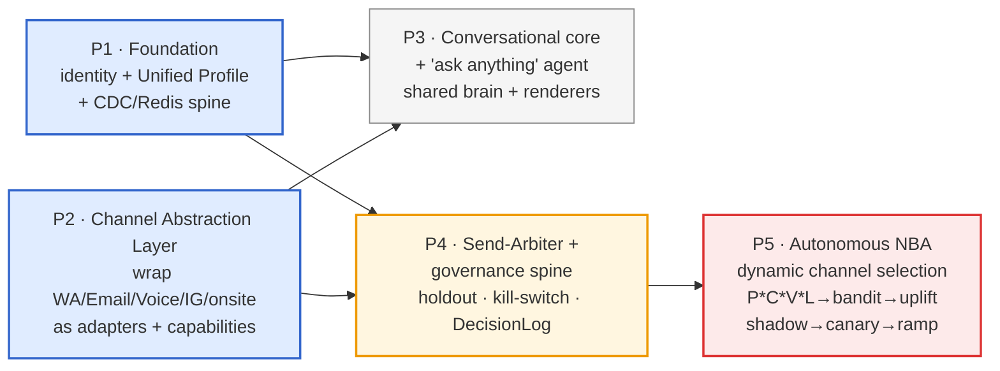

# Hyper-Personalization at Scale — North-Star Strategy & Architecture
### TextYess "Segment-of-One Engine" — an **omnichannel conversational** intelligence & decisioning platform

> **Deliverable type:** whole-vision strategy + architecture thinking artifact (no code in this doc).
> **The prize:** bounded-autonomous, per-contact next-best-action marketing that **dynamically chooses the channel** and learns from outcomes.
> **Core stance:** **channel-agnostic.** WhatsApp, Email, Voice, Instagram, onsite, SMS (and whatever's next) are **pluggable peers** behind one Channel Abstraction Layer. The brain is channel-neutral; channels are adapters.

---

## 1. Context — why this, why now

You want four capabilities for every contact of every organization:

1. **A unified per-contact intelligence layer** — all data we could collect about one person, in one place.
2. **An agent that can answer *any* question about that contact**, grounded in that data.
3. **Per-contact channel decisioning** — who to reach, when, on which channel, inbound *and* outbound — **dynamically per user**.
4. **Autonomous hyper-personalized marketing** — decide *what / when / which channel / which message* per contact, and learn from results.

**The reframe that makes this tractable:** you already own every expensive piece of a *domain CDP for conversational commerce* — event collection (conversations, orders, web-pixel, email), a warehouse (Redshift with RFM/LTV/churn), an activation layer (campaigns, dynamic Mongo segments, Flow-v2 on Temporal), and an LLM brain (brain0/Agno). The work is to **unify, persist, and close the loop** on intelligence you already generate and throw away — **and to make every layer channel-agnostic** so the platform scales as you add conversational channels.

**Decisions taken in our session (these constrain everything below):**
- **D1.** Deliverable = whole-vision strategy doc (this file). No code yet.
- **D2.** Headline ambition = **autonomous NBA marketing** (highest value/risk). Roadmap = the fastest *responsible* path to it.
- **D3.** End-state autonomy = **bounded** — agent acts within hard guardrails + kill switch + always-on holdout.
- **D4.** Decisioning chokepoint + serving live in **Node/NestJS + Redis/Mongo** (near data & activation); **brain0 stays the reasoning/agent layer**.
- **D5. Channel-agnostic core.** Every channel is a **pluggable adapter** behind a uniform Channel Abstraction Layer; the intelligence/decisioning core never changes when a channel is added. The one honest seam — sync (voice) vs async (messaging) — is modeled as an interaction `mode` *inside* the abstraction, not as a special-cased channel.
- **D6. Conversation continuity = pragmatic hybrid.** One contact conversation timeline; per-channel sessions under it; **memory is always cross-channel**; visible thread continuity is best-effort (continuous where a channel transition allows it, linked sessions where it doesn't).
- **D7. Channel choice optimizes a *learned blend*** of engagement × cost × preference (not a fixed waterfall, not a single objective).
- **D8. Agent = shared intelligence core + per-channel presentation/format layer** (one brain, channel renderers).

---

## 2. Current state — what exists vs. the gap

**Strong data foundation (🟢 have):**
- `packages/models/src/models/contact.ts` — identifiers, per-channel consent (`opt_in`, `email_opt_in`), tags, segments, capped 500-event `activity_log`. *No derived intelligence or scores here.*
- ~12 behavioral collections = a de-facto **event layer**: `brain0-conversations`, `whatsapp-bot-conversations`, `instagram-conversations`, `onsite-chats`, `cms-orders`, `web-pixel-event`, `email-event`, `cart`, `message-event`, `voice-call-record`.
- `apps/api/src/services/redshift/redshift.service.ts` — **already computes RFM + LTV + churn** per contact (not exposed via API, not cached in Mongo).
- **Channels already exist in fragments:** WhatsApp (`apps/api/src/integrations/whatsapp/` + 360dialog), Email (`apps/api/src/email/` + Brevo/Mailgun), Voice (`apps/api/src/voice-agent/` + ElevenLabs, inbound), Instagram (`apps/api/src/services/instagram/`, partial), Onsite (`apps/api/src/onsite-chats/`, inbound). *They are siloed, each with bespoke send/receive logic — no uniform interface.*

**Working prototypes already in code (🟡 seeds — the key insight):**
- `apps/brain0/src/dynamic_messages/preprocessing/classifier.py` — a **deterministic lifecycle state machine**. Runs per-message, then discarded.
- `apps/brain0/src/dynamic_messages/models.py::CustomerIntelligence` — the **qualitative profile** (`signals`, `opportunities`, `cautions`, `momentum`). Computed then thrown away.
- `ProposedStrategy` (`times_used`/`times_converted`) — a **primitive bandit/learning loop**.
- `apps/brain0/src/agents/deep_agent/runner.py` — the **collectors→synthesizer→persist** orchestration pattern.
- brain0 already has **per-channel orchestrators** (`agents/orchestrators/whatsapp.py`, `onsite.py`) — the seed of "shared core + per-channel renderer," not yet generalized.

**The gaps (🔴 the actual project):**
1. No **unified persisted profile** (with generic per-channel state).
2. No **persistent per-contact memory** (cross-channel Dossier).
3. No **channel-agnostic agent** that answers anything, grounded.
4. No **Channel Abstraction Layer** — channels are bespoke silos, not pluggable.
5. No **dynamic per-contact channel decisioning** (learned blend).
6. No **autonomous NBA engine** with a single arbiter, holdout, and learning loop.

---

## 3. Design principles (the non-obvious ones that prevent expensive mistakes)

1. **Channel-agnostic core via a Channel Abstraction Layer.** The brain deals only in *channel-neutral actions* + *unified inbound events*; adapters translate both ways. Adding a channel = writing an adapter. (D5)
2. **Profile + events, never denormalization.** Keep the ~12 collections as the append-only *event* layer; add *one* materialized `UnifiedContactProfile` on top. Events are truth; traits are recomputable projections.
3. **Hybrid grounding is make-or-break for the agent.** Numeric/relational facts → deterministic tools over a semantic layer; qualitative → vector RAG. Never let the LLM compute spend/order-counts from text. (Benchmark: semantic layer 98–100% vs text-to-SQL 84–90%, which *fails silently*.)
4. **Uplift, not propensity.** Targeting "likely to buy" wastes spend on Sure Things and provokes Sleeping Dogs to *block/opt-out* (often irreversible per channel). Model *whom the message changes* → **always-on holdout from day one**.
5. **One arbiter, or chaos.** All outbound — across all channels — funnels through a single **arbitration chokepoint** that selects *at most one* (action × channel × timing). Keystone for #3 and #4.
6. **Channel is a first-class, *dynamic* decision dimension** optimized as a learned blend of engagement × cost × preference — not a hardcoded "primary + fallback." (D7)
7. **Operational spine + cold-start as the default case.** CDC→Redis serving; two-tier holdout (per-org + pooled); kill switch + per-channel circuit breakers; platform→org→contact priors (most contacts are thin; every new merchant starts empty).

---

## 4. North-star architecture — the channel-neutral core + the Channel Abstraction Layer



### ② Channel Abstraction Layer (CAL) — the reframe's keystone
A uniform interface every channel implements, plus a declarative **capability descriptor** so the core reasons over *capabilities*, never channel-specific code:

```
ChannelAdapter (per channel: whatsapp | email | voice | instagram | onsite | sms | …)
  capabilities:
    direction:      inbound | outbound | both
    mode:           async_message | sync_session     # voice = sync_session; messaging = async_message
    message_forms:  [text, media, buttons, template, html, audio, …]
    session_window: { type: rolling_24h | none | call, reset_on_inbound }   # WA/IG=24h, email=none, voice=call
    identifiers:    [phone | email | ig_id | device | …]
    consent_model:  { required, categories, regulatory: [GDPR|TCPA|CAN-SPAM|Meta] }
    cost_model:     { free_in_window?, per_message?, per_minute?, template_categories? }
    health_signal:  { name: quality_rating | deliverability | …, source }
    rate_limits:    { … }
  behaviors:
    normalizeInbound(rawProviderPayload) -> UnifiedInboundEvent
    render(channelNeutralAction, profile)  -> ChannelMessage
    send(ChannelMessage)                   -> SendResult
    eligibility(contact, action)           -> { eligible, reasons, cost, window_state, health_headroom }
```
- **Refactor, don't rebuild:** wrap the existing 360dialog / ESP / ElevenLabs / IG / onsite integrations as the first adapters. WhatsApp's 24h-window + template categories become *that adapter's* `session_window` + `cost_model` — one channel's descriptor, not the platform's center of gravity.
- **Two interaction modes** keep voice honest: the orchestrator branches on `mode`, not on channel name.

### L0 · Identity Resolution (multi-identifier, no primary)
Per-org identity graph; **phone, email, IG handle, device are peers** (no hardcoded primary). Deterministic-first matching, per-identifier limits, confidence threshold for fuzzy, **merge audit log**. **Never stitch identifiers across orgs.** **Consent/opt-out is sticky** — never silently merged.

### L1 · Unified Profile + Intelligence (channel-neutral, with generic per-channel state)
- **`UnifiedContactProfile`** (one per resolved person, per org). Holds resolved identifiers, channel-agnostic traits, lifecycle state, Dossier — **and a generic `channels[]` map**:
  ```
  channels[]: { type, identifier, reachable, consent{status,category},
                engagement_score, preference_rank, last_inbound_at,
                window/eligibility_state, cost_hint, health }
  ```
  This is what makes channel decisioning a *single profile lookup* and keeps the core channel-neutral.
- **Computed traits, two-speed:** *batch* (Redshift, nightly) RFM, predicted CLV (BG/NBD + Gamma-Gamma), churn/p(alive), product affinity; *streaming* (CDC, seconds) last_product_viewed, abandoned_cart_value, per-channel reachability/engagement/window state, consent.
- **Lifecycle state machine:** promote `classifier.py` to a **persisted, first-class state**. Highest-ROI transition: first-time → second purchase.
- **Contact Dossier (persistent, *cross-channel* memory):** replace the throwaway `CustomerIntelligence` with **episodic + semantic + procedural** memory. Per-contact embeddings in **MongoDB Atlas Vector Search**, namespaced `org_id + contact_id`. **Bi-temporal facts** for things that change (consent, VIP, preferences). Memory is shared across *all* channels (D6).
- **Serving:** **Redis online feature view** per contact for <50ms reads — a token-cost win as much as latency.

### L2 · Conversational Agent core (shared brain + per-channel renderers) (#2, D8)
- **One channel-agnostic reasoning core** (brain0/Agno) generalizing today's whatsapp/onsite orchestrators. **Hybrid grounding** + citations + abstention; consent/window are live tool reads.
- **Per-channel presentation layer** renders the same decision into the channel's form (WhatsApp structured message, email HTML, voice SSML/TTS turn, IG DM) via the CAL `render()`.
- **"Ask anything about a contact"** is this core in read-only mode, surfaced in the inbox — the safe, demo-able win.
- **Conversation model (D6):** one **contact conversation timeline**; per-channel **sessions** are children; continuity is presented where a transition allows it, linked-session where not.

### L3 · Dynamic Channel + Timing Decisioning (#3, D7)
- **Next-best-channel scorer** optimizes a **learned blend of engagement × cost × preference**, reading the profile's `channels[]` + the CAL capability/eligibility for each channel. No "primary." Eligibility hard-gates (consent, window/mode, health headroom, rate limits, regulatory).
- **Send-time optimization** per channel from existing timestamps; quiet hours **shift** (never drop); cold-start fallback to org-popular hour.

### L4 · Autonomous Next-Best-Action (#4 — the prize)
- **Send-Arbiter (single chokepoint):** the **only** authorizer of an outbound touch. Campaigns, Flow-v2 steps, and proactive agent messages submit **channel-neutral candidate actions**. The arbiter (a) hard-gates (consent + per-channel eligibility/window + frequency + quiet hours + health + **kill switch**); (b) scores survivors over **(action × channel × timing)** by intent-priority × propensity × value × cost × uplift; (c) authorizes **≤1**; **"do nothing" is valid and often optimal**. Idempotent; reads caps transactionally; then CAL `render()`+`send()`.
- **The learner — crawl/walk/run** (reuses the `ProposedStrategy` seed): **v1 P\*C\*V\*L** prioritization (no new ML) → **v2 contextual bandit** (Thompson) where **channel is a decision dimension**, with platform→org→contact priors → **v3 uplift/CATE causal bandit** once the holdout accrues.
- **Campaign-Planner agent fleet:** reuse Agno collectors→synthesizer for prompt-to-journey (audience / content / channel / timing sub-agents), **bounded** per D3.

---

## 5. The closed decision loop (channel chosen dynamically, learns from outcomes)

```mermaid
flowchart LR
    TRIG([trigger: inbound any channel · cart · churn-risk · schedule]) --> RESOLVE[resolve identity<br/>→ load profile + channels[] from Redis]
    RESOLVE --> CANDS[generate channel-NEUTRAL candidate actions<br/>campaigns · flows · agent · NBA]
    CANDS --> GATE{hard gates per channel<br/>consent · window/mode · frequency<br/>quiet hours · health · kill-switch}
    GATE -- none eligible --> NONE[do nothing]
    GATE -- eligible action×channel set --> SCORE[score action × channel × timing<br/>engagement × cost × preference × uplift<br/>+ holdout check]
    SCORE --> PICK[pick ≤1 winner:<br/>action + channel + send-time]
    PICK --> RENDER[CAL render → channel-specific message] --> SEND[send via chosen channel]
    SEND --> OUT[(outcome: delivered·read·replied·bought·blocked·opted-out)]
    OUT -->|write back as events| RESOLVE
    OUT -->|reward signal| SCORE
    OUT -->|update Dossier 'what works' incl. channel| RESOLVE
    style GATE fill:#fdeaea,stroke:#d33
    style OUT fill:#e7f7ec,stroke:#3a3
    style NONE fill:#eee,stroke:#999
```

---

## 6. The operational spine (the part most "AI personalization" plans omit)

- **Data substrate:** Mongo **change streams** (not Kafka) → one idempotent stream consumer (NestJS worker) → updates the hot profile + streaming traits, emits domain events (`contact.entered_segment`, `trait.crossed_threshold`, `csw.opened`) onto **RabbitMQ/BullMQ**. **Persist resume tokens.** **Redis online store** for <50ms serving. Avoid **training-serving skew** (train on logged served features).
- **Measurement:** **two-tier holdout** (per-org for large merchants; **pooled platform-level** for the long tail that can't reach significance); **switchback** as default lightweight mode; explicit **attribution windows**; reward = **incremental** revenue vs holdout. Now also measures **channel-mix lift**.
- **Governance (bounded autonomy):** **per-org + global kill switch**; **per-channel circuit breakers** (each channel's health signal — WA quality rating, email deliverability/spam-rate, IG/SMS block rate, voice complaint rate — auto-pauses *that* channel); **economic budget caps** (send-spend + discount/margin) that auto-pause and escalate; **bounded action bank**; **graduated autonomy levels**; **online LLM eval** (Langfuse); one **immutable DecisionLog** per arbitration (`{org, contact, candidates(action×channel), feature_vector, scores, chosen|none, holdout_flag, permitting_guardrail, outcome_ref}`).
- **Cold-start = default:** thin contact → RFM + intent + platform prior; warming → org-prior bandit; mature → personalized uplift. New merchant bootstraps from anonymized cross-org prior.
- **Multi-tenant ML:** **one shared base model conditioned on org-level features** + per-org priors; train only on **aggregated/anonymized** signal; enforce `org_id` isolation on every feature read, vector query, identity edge.
- **Compliance backbone:** **per-channel consent ledger** `{channel, category, status, source, timestamp, legalBasis}` — each channel carries its own regulatory model (Meta for WA/IG, TCPA for voice/SMS, CAN-SPAM/unsubscribe for email, GDPR/ePrivacy across all); **preference center**; **right-to-erasure cascade** across all collections + brain0 caches + Redshift + embeddings.

---

## 7. Roadmap — the fastest *responsible* path to bounded-autonomous, omnichannel NBA



| Phase | Goal | Core scope | Exit criteria |
|---|---|---|---|
| **P1 — Foundation** | One fresh profile per contact | Identity graph (multi-id); `UnifiedContactProfile` + per-channel state + traits; expose Redshift scores; CDC→Redis spine | Profile readable <50ms; traits fresh; powers existing segments |
| **P2 — Channel Abstraction Layer** | Channels become pluggable peers | Uniform adapter + capability descriptors; wrap existing WA/Email/Voice/IG/onsite integrations; unified inbound event + channel-neutral action contracts | Every channel sends/receives through one interface; adding a channel = adapter only |
| **P3 — Conversational core + agent** *(visible win)* | Channel-agnostic brain; answer anything | Generalize brain0 orchestrators → shared core + per-channel renderers; hybrid agent + Dossier; inbox surface | Grounded answers w/ citations; one brain renders correctly across channels |
| **P4 — Arbiter + governance** | Safe chokepoint *before* autonomy | Send-Arbiter (action×channel gates + priority); DecisionLog; two-tier holdout; kill switch + per-channel breakers; consent ledger | All outbound flows through arbiter; holdout live; lift measurable; kill switch verified |
| **P5 — Autonomous NBA** | The prize, bounded, omnichannel | Dynamic channel selection (learned blend); P\*C\*V\*L → bandit(action×channel×timing) → uplift; Campaign-Planner fleet; shadow→canary→ramp; budget caps | Proven incremental lift vs holdout; agent picks channel dynamically within guardrails; humans review exceptions only |

**Recommended order:** **P1 + P2 in parallel** (both foundational) → **P3** (visible win; also exercises CAL outbound rendering) → **P4** → **P5**. Critical path to the prize: **P1 + P2 + P4 → P5**; P3 parallelizes and should not pull focus from that spine.

---

## 8. Key architectural decisions (ADR-style)

- **ADR-1 Build a channel-agnostic conversational intelligence & decisioning platform** (domain CDP for conversational commerce) — **not** a WhatsApp vertical, not a horizontal CDP. *Why:* you own collection/warehouse/activation/AI and are expanding channels; the core must be channel-neutral.
- **ADR-2 Channel Abstraction Layer** — uniform adapter (`normalizeInbound/render/send/eligibility`) + capability descriptors; **two interaction modes** (async_message / sync_session) absorb the voice-vs-messaging seam. *Why:* adding a channel becomes an adapter, never a core change.
- **ADR-3 Profile + events, materialized hot; CDC via Mongo change streams + RabbitMQ/BullMQ (no Kafka).** *Why:* avoids denormalization; sub-second deltas on existing infra.
- **ADR-4 Hybrid grounding** (semantic-layer tools + vector RAG + citations/abstention). *Why:* prevents hallucinated customer facts.
- **ADR-5 Single Send-Arbiter in Node/Nest; channel is a first-class decision dimension** optimized as a learned blend. *Why:* ends uncoordinated cross-channel double-sends; makes channel choice dynamic per contact.
- **ADR-6 Shared agent core + per-channel renderers** (one brain). *Why:* consistent intelligence, channel-appropriate presentation, no per-channel logic duplication.
- **ADR-7 One contact conversation timeline; per-channel sessions; cross-channel memory; hybrid continuity.** *Why:* unified context without forcing impossible cross-channel threading.
- **ADR-8 Always-on two-tier holdout from day one; bounded autonomy with graduated levels + per-channel circuit breakers.** *Why:* uplift/ROI need a control group; irreversible per-channel damage needs hard stops.
- **ADR-9 Shared-base multi-tenant model + per-org priors.** *Why:* cold-starts small merchants, personalizes as data accrues, avoids a model zoo, contains leakage.

---

## 9. Top risks & mitigations

| Risk | Why it bites here | Mitigation |
|---|---|---|
| **Leaky channel abstraction** | Forcing voice/email into a message-shaped interface creates special cases everywhere | Capability descriptors + `mode` (async/sync); design the descriptor before the 2nd adapter |
| **Bad/irreversible identity merges** | Shared phone / guest-checkout email fuses two people; corrupts consent | Deterministic-first, identifier limits, threshold, sticky consent, audit log |
| **Agent hallucinates customer facts** | Drives a bad send on any channel | Hybrid grounding, semantic layer, citations, abstention; live consent/window reads |
| **Channel fatigue → blocks/opt-outs/spam** | Per-channel reputation damage (WA quality, email spam-rate, IG/SMS blocks) | Uplift modeling, per-channel block-risk, per-channel circuit breakers |
| **Uncoordinated senders across channels** | Campaigns + flows + agent double-send across channels | Single Send-Arbiter authorizes ≤1 |
| **Cold-start (the modal case)** | Thin contacts + new merchants | platform→org→contact priors; RFM/intent fallback |
| **Holdout has no power for small merchants** | Can't prove lift per tiny org | Pooled platform-level holdout + switchback |
| **Autonomous agent margin/brand damage** | Free offers destroy margin; off-brand copy ships on any channel | Budget caps (auto-pause), bounded action bank, online eval, human-approval tier |
| **Training-serving skew** | Bandit trains on Redshift, scores on Redis | Define each trait once; train on logged served features |

---

## 10. Explicitly NOT doing (YAGNI)

❌ A WhatsApp-vertical design. ❌ Buying a horizontal CDP. ❌ Kafka/Debezium (unless volume forces it). ❌ A full feature-store framework — implement the *pattern* in Redis. ❌ Per-tenant model zoo. ❌ Full sequential RL initially (start with bandits). ❌ Per-channel bespoke logic in the core (everything channel-specific lives in adapters). ❌ Flipping autonomy on live (shadow→canary→ramp only).

---

## 11. How we'll know it works (verification)

- **Incrementality:** lift vs holdout (per-org where powered, pooled otherwise) — including **channel-mix lift** — is the headline ROI number.
- **Agent quality:** groundedness/citation pass rate + abstention correctness + sampled live traffic (Langfuse), across channels.
- **Channel decisioning:** per-channel delivery/engagement; dynamic-selection beats fixed routing in A/B; **each channel's health signal stays green**.
- **Performance/cost:** profile read p99 <50ms; brain0 per-message token cost down.
- **Extensibility:** adding a new channel touches only an adapter + capability descriptor (no core change) — the litmus test of the abstraction.
- **Safety:** kill switch + per-channel breakers verified in a drill; DecisionLog complete/replayable; zero cross-tenant leakage.

---

## 12. Open questions for next iteration (strategy → build spec)

1. **First build target within P1** — identity graph first, or materialize the profile from existing keys and add resolution later?
2. **Channel adapter priority** — which channels to wrap first (likely WhatsApp + Email, then Voice/IG)?
3. **Holdout %** and merchant visibility/override.
4. **Autonomy tiers** — which decisions are auto vs human-approved at launch (channel + send-hour auto; discounts/new-channel-expansion human?).
5. **Conversation continuity rules** — which channel transitions present as continuous vs linked sessions.
6. **Pilot cohort** — one high-volume + one long-tail merchant, ideally multi-channel, to validate both holdout tiers and the CAL.

*Next step after approval: turn P1 + P2 (foundation + Channel Abstraction Layer) into a buildable spec — they are the channel-agnostic bedrock everything else hangs off.*
